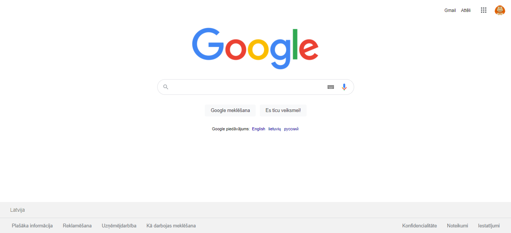
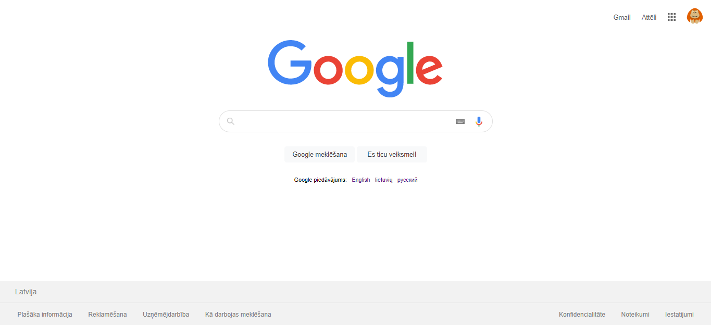

# HTML_Majaslapas
Google.com un Google.com meklējumu rezultātu meklējumam "RVT" kopijas

## Kāds bija gala mērķis?
Gala mērķis bija uztaisīt `www.google.com` mājaslapas un google meklējuma `RVT` rezultātu lapas kopijas rakstot HTML "kodu".

## Kā veicu darbu?
Darbs tika veikts Visual Studio Code lietotnē.

Lai priekšskatītu darbu tika izmantots speciāls paplašinājums VSC vārdā `Quick HTML Previewer`. Tas atver HTML saiti pārlūkprogrammā un atjauno to katru reizi kad VSC HTML failā tiek saglabātas kādas izmaiņas un tas ir praktiski viss ko šis paplašinājums dara. Ja jūs strādājat ar HTML daudz, tad šis paplašinājums ļaus daudz ātrāk redzēt kā jūsu kods izskatās mājaslapā.

## Kapec repozitorijā ir attēli kaut vai koda nav pielietotas relatīvie vai pilnie ceļi uz šiem atēliem?
Attēlus es vainu atradu internetā un modificēju savām vajadzībām vai uzzēmēju pats.

Attēlu relatīvie vai pilnie ceļi netiek pielietoti jo šis ir man ir vieglāk augšupielādēt failu servera krātuvē un pielietot linku nekā meiģināt izlabot un saprast kapēc kārtējo reizi identisks relatīvs ceļš nestrādā kaut vai vis ir pareizi :)

## Kā atradu informāciju par HTML "tagiem"?
Informāciju par tagiem un to pielietojumiem atradu internetā, lielākoties meklējot specifiski šādi
```
HTML How to <īss-un-precīzs-vēlamā-rezultāta-apraksts-angļu-valodā>?
```
Nav bijis gadijums kad ar šo jautājumu meklēšanas veidu neatradu atbildi. Daudzi cilvēki nemāk pareizi meklēt jautājumus, tādēļ  viņiem informācijas atrasšana ir daudz lēnāka tādējādi arī grūtāk būs būt programmētājam. Zināt kā pareizi atrast atrast atbildi uz kādu jautājumu internetā ir liela daļa no darba, tādēļ to ir jāmāk darīt ātri un effektīvi un spēt ātri izsijāt pareizāko un visizpalīdzīgāko atbildi.

# Darba rezultāti
Jūs varat meiģināt uzimēt kurš no attēliem ir mans un kurš ir google oriģināls, un pārbaudīt jūsu minējumu izplešot atbildi.

<details>
  <summary>Pirmā bilde ir...</summary>
  Oriģinālā sākuma lapa.
</details>


---

<details>
  <summary>Otrā bilde ir...</summary>
  Mans Google sākumlapas veidošanas meiģinājums
</details>
 <!--ja šitais nestrādās es nezinu, augšupielādēšu kautkur un lietošu linku.-->
